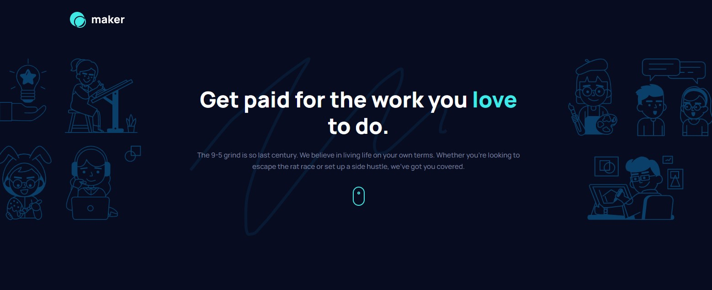

# Frontend Mentor - Maker pre-launch landing page solution

This is a solution to the [Maker pre-launch landing page challenge on Frontend Mentor](https://www.frontendmentor.io/challenges/maker-prelaunch-landing-page-WVZIJtKLd).

## Table of contents

- [Overview](#overview)
  - [The challenge](#the-challenge)
  - [Screenshot](#screenshot)
  - [Links](#links)
- [My process](#my-process)
  - [Built with](#built-with)
  - [What I learned](#what-i-learned)
  - [Continued development](#continued-development)
  - [Useful resources](#useful-resources)
- [Author](#author)

## Overview

### The challenge

Users should be able to:

- View the optimal layout depending on their device's screen size
- See hover states for interactive elements
- Receive an error message when the form is submitted if:
  - The `Email address` field is empty should show "Oops! Please add your email"
  - The email is not formatted correctly should show "Oops! That doesn’t look like an email address"

### Screenshot

### Links

- Solution URL: [github.com/emjogale/maker-landing-page](https://github.com/emjogale/maker-landing-page)
- Live Site URL: [maker-landing-page-emjogale.vercel.app](https://maker-landing-page-emjogale.vercel.app/)

## My process

### Built with

- Semantic HTML5 markup
- CSS custom properties
- Flexbox
- Mobile-first workflow

### What I learned

- I looked into various ways of centering content - using flexbox and other approaches.
- I went for the flexbox approach and realised that flexbox isn't just for the main layout of a page but can be used in small sections.
- I learnt you can change the display of a heading element to inline-block so you can absolutely position a span against the text within the heading.
- An interesting challenge was finding out how to change the colour of an SVG image - by changing the 'fill' propery in the SVG file.
- I learnt how to use the :nth-child selector to style alternating siblings differently.

### Continued development

- When using the mobile first development approach, I need to spend more time pre-planning to take into consideration the different screen size layouts. This should help with the structure of the html so it works for each screen size without too much alteration.
- I need to look into the background property and how the various properties such as background position affect its use.

### Useful resources

- [How to Center an Image Vertically and Horizontally with Css](https://www.freecodecamp.org/news/how-to-center-an-image-in-css/) - This helped me with centering the smaller images within their containers.
- [How to Change the Colors of SVG Graphics](https://ggnome.com/wiki/how-to-change-the-colors-of-scalable-vector-graphics) - This explained changing the 'fill' property of an SVG to change its colour.
- [Flexbox cheatsheet](https://jonitrythall.com/content/flexboxsheet.pdf) - I found this a useful resource for clarifying the flexbox properties.

## Author

- Frontend Mentor - [@emjogale](https://www.frontendmentor.io/profile/emjogale)
- Twitter - [@emmagale2635](https://www.twitter.com/emmagale2635)
